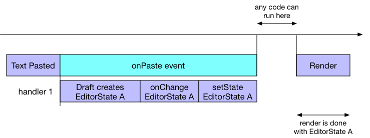

# EditorState竞速条件

Draft的`Editor`组件是一个受控制的输入组件（你可以阅读[基础API](../quick-start/api-basics.md)了解详情），意味着状态改变会通过`onchange`向上传递，并通过props再传递回给`Editor`组件。

这个闭环通常就像这样：

```javascript
this.onChange = function(editorState) {
  this.setState({editorState: editorState});
}
// ...
<Editor
  editorState={this.state.editorState}
  onChange={this.onChange}
  placeholder="Enter some text..."
/>
```

默认的浏览器事件能够触发`Editor`产生一个新的状态，并调用`onchange`。例如，当用户粘贴文本时，Draft 粘贴新的内容，并且新建对应的数据结构来展示它。

在这种情况下，这个闭环工作的很好。但是这是一个异步的过程，因为调用了`setState`。在设置状态和浏览器更显状态之间可能有延迟，在这期间是可以执行其它js代码的。



像这样的操作可能会引入竞争条件。这有一个示例：假如你想移除粘贴文本中的样式。这可以通过监听onParse事件并且去掉EditorState中的样式。

```javascript
this.onPaste = function() {
  this.setState({
    editorState: removeEditorStyles(this.state.editorState)
  });
}
```

然而，这个不会按照期望运行。你现在有两个事件处理程序，在同一个浏览器事件中设置2次`EditorState`。由于事件处理程序一个一个执行，所以后执行的处理程序会占据上风。下面是在JS时间线中的样子：


可以看到，因为`setState`是一个异步操作，第二个`setState`会覆盖第一次的内容，会使`Editor`失去所有的粘贴的内容。

你可以在这个[运行的示例](https://jsfiddle.net/qecccw3r/)中观察和探索竞速条件的情况。这个示例打印了js时间线，请打开开发者工具查看。

为了避免因为不同的事件处理程序处理同一个事件，使用setTimeout调用`setState`可能出现同样的情况。无论何时，当你感觉到你`丢失了状态`，请确认你没有在`Editor`渲染之前覆盖它。

## 最佳实践

现在你知道了问题的所在，怎么避免这样的情况呢？通常要注意你从哪里得到EditorState。如果你使用本地的（存储在this.state），那么它有可能不是最新的。为了最大限度的解决这个问题，Draft在大多数回调函数中传入最新的`EditorState`而不是本地的，来确保你的改变是基于最后的状态。下面是一些Editor中支持的回调函数。

* handleReturn(event, editorState)
* handleKeyCommand(command, editorState)
* handleBeforeInput(chars, editorState)
* handlePastedText(text, html, editorState)

那个粘贴的示例可以这样重写：

```javascript
this.handlePastedText = (text, styles, editorState) => {
  this.setState({
    editorState: removeEditorStyles(text, editorState)
  });
}
//...
<Editor
  editorState={this.state.editorState}
  onChange={this.onChange}
  handlePastedText={this.handlePastedText}
  placeholder="Enter some text..."
/>
```
通过`handlePastedText`你可以控制粘贴行为。

注意：如果你要在你的编辑器中实现这个功能，这里有个更简单的方式。只需要设置`Editor`的`stripPastedStyles` prop为`true`就行了。
